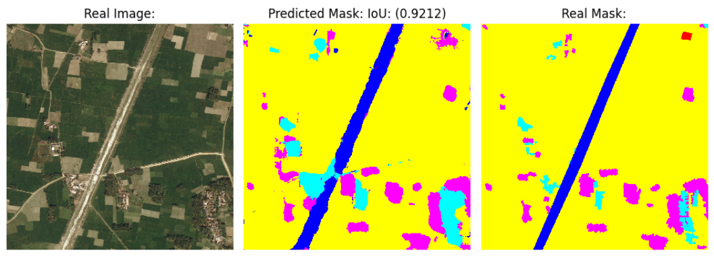

# Satellite Image Segmentation with U-Net

This project implements a semantic segmentation pipeline for satellite imagery using a U-Net convolutional neural network. The entire workflow is contained in a single Jupyter notebook, from dataset download to training and evaluation.

The model is trained on the **DeepGlobe Land Cover Classification dataset** and predicts a land cover class for each pixel in an input satellite image.

## Overview

The notebook covers the full segmentation pipeline:

- Automatic download and extraction of the DeepGlobe dataset
- Image and mask preprocessing with OpenCV and NumPy
- Conversion of RGB mask encodings into integer class labels
- Custom U-Net implementation using TensorFlow and Keras
- Training with Dice loss and IoU and weighted F1 metrics
- Simple data augmentation using random affine translations
- Model checkpointing based on validation loss
- Quantitative evaluation with confusion matrices
- Qualitative visualization of predictions versus ground truth masks

## Dataset

The project uses the DeepGlobe land cover classification dataset. Each sample consists of:

- A high resolution `2448 x 2448` BGR satellite image
- A corresponding BGR mask encoding land cover classes

Masks are converted into a single channel label map with **7 classes** (6 classes + an Unknown class), where each pixel stores an integer class ID.

Images are resized from their original resolution to `1224 x 1224` to fit memory constraints during training.

## Model

The segmentation network is a U-Net style encoder-decoder architecture:

- Encoder blocks use stacked convolutions, batch normalization, and max pooling
- Decoder blocks use transposed convolutions and skip connections
- A final `1x1` convolution produces per pixel class logits
- Input images are normalized inside the model

The architecture depth, number of filters, and dropout rate are configurable in the notebook.

## Training

- Loss function: multi class Dice loss
- Optimizer: AdamW with exponential learning rate decay
- Metrics: weighted F1 score and intersection over union (IoU)
- Batch size and number of epochs are defined in the notebook
- The best model is saved automatically based on validation loss

A lightweight data augmentation step applies random translations to both images and masks during training.

## Evaluation and visualization

After training, the notebook:

- Reloads the best performing model checkpoint
- Generates segmentation predictions on validation samples
- Displays side by side comparisons of input images, predicted masks, and ground truth masks
- Computes and visualizes confusion matrices
- Reports F1 scores for qualitative inspection

An example of segmentation of a validation image, showing how the fields are separated across a road, can be seen below:

## Notes

- The notebook is designed to be run end to end in a Jupyter environment.
- GPU acceleration is supported and automatically detected by TensorFlow.

This repository is intended as a clear, hands on example of semantic segmentation for satellite imagery using TensorFlow and U-Net.
